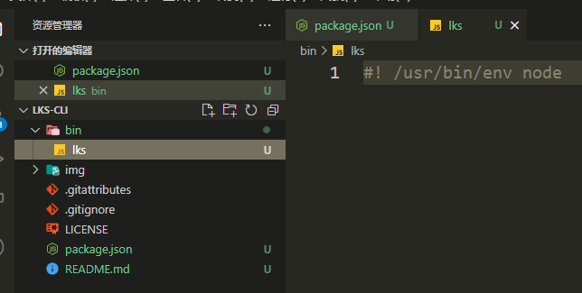

# 手写一个自己的前端脚手架

提到脚手架，你可能会想到vue-cli、create-react-app、dva-cli...,他们有一个共同的特点，那就是不够**专一**！如果你在公司使用它们，会出现以下一系列的问题。

- 业务类型多
- 多次造轮子，项目升级等问题
- 公司代码规范无法统一

很多时候我们开发新建项目的时候，把已有的项目代码复制一遍，保留基础能力。（但是这个过程非常繁琐而又耗时）。那我们可以自己定制化模板，自己实现一个属于自己的脚手架来解决这些问题。

# 前置

1. 先创建可执行的脚本<font color="#09f">(固定写法)</font> `#! /usr/bin/env node`

   首先我们初始化`package`,并在根目录下创建一个`bin`文件夹，并增加`lks`文件，如下图所示，表示用电脑中自带的node环境来执行代码

   

2. 配置`package.json`中的`bin`字段

   ```json
   {
       ...,
   	"bin": {
       	"lks": {
       		"lks": "./bin/lks"
   		}
       }
   }
   ```

   

3. 通过`npm link`链接到本地，把包临时放到全局上<font color="#f90">(注意：如果配置了则需要通过`npm link --force`重新强制执行一下)</font>

   > link相当于将当前本地模块链接到npm目录下，会产生一个`xxx.cmd`的文件，如果不需要link了，我们同样也可以通过命令`npm unlink`把该cmd取消掉

4. 配置可执行命令(通过`commander`工具包来完成)

   <font color="#f00">详情请看下章↓</font>

# commander工具的使用

commander 是一个命令行解决方案。通过它可以告诉用户脚手架的命令与功能，以及处理用户输入。

```bash
npm install commander
```

